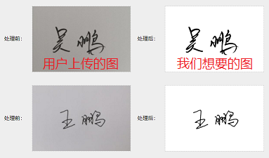
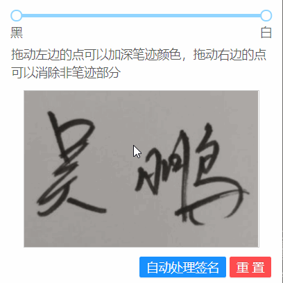

# 前端使用 Canvas 进行图像处理，将手写签名照片转换成扫描件效果

## 为什么要在前端处理图片

最近开发业务系统时遇到了一个不常见的需求：**处理图片使除了笔迹外的内容显示为白色/透明**

**业务场景：**

用户将个人签名图片上传到系统中，管理员使用这个签名打印文件。原本打印功能需要的是白底黑字的签名，但由于没有特殊限制，大部分用户就直接用笔纸签名拍照后就上传到系统中了（实际上应该上传白纸黑字扫描件）。这导致管理员打印时把会把照片的背景色也打印到纸张上，影响打印效果。为了方便管理员操作（避免再去让用户重新上传签名），需要提供一个能够将手写签名照处理成符合打印要求的图片的功能

**目标效果**



## 实现原理

**思路：** [参考PS中的色阶工具](https://www.zhihu.com/question/51786114/answer/127565209)，灰度转换 + 阈值处理（二值化）

### Step 1: 使用 Canvas 读取和修改图片的色值

在学校时就有选修过**数字图像处理**的课程，所以我可以确定这个需求简单实现起来并不会太难（产品要求不高的情况下），但是以前学习时都是使用 MATLAB 处理图片的，对怎么使用浏览器处理图片并不清楚。

经过查询得知，Canvas 可以获取指定区域的像素值，张鑫旭的[这篇文章](https://www.zhangxinxu.com/wordpress/2018/05/canvas-png-transparent-background-detect/)就是不错的示例，相关API：

- `canvas.drawImage`: 在 Canvas 上绘制图片

- `canvas.getImageData`: 获取 Canvas 上指定区域的像素值

- `canvas.putImageData`: 修改 Canvas 上指定区域的像素值

### Step 2: 将用户上传的彩色照片转换成灰度图

因为最终需要的签名是白底黑字的，不需要彩色，所以可以将图片转换成灰度图方便计算：

`canvas.getImageData` 返回的是 `Uint8ClampedArray(960000)` 数组，其中 `960000 = 600（原图宽） * 400（原图高） * 4（每个像素对应数组中4个元素）`，每个像素对应数组中4个元素分别是 `[R, G, B, Alpha]` 即 `[红, 绿, 蓝, 透明度]`，取值范围均为 `[0-255]`

**灰度计算的经验公式：** `Gray = 0.299 * R + 0.587 * G + 0.114 * B`

```javascript
const gray =
  0.299 * imageData.data[coordinate] +
  0.587 * imageData.data[coordinate + 1] +
  0.114 * imageData.data[coordinate + 2];

// 赋值给 RGB，将彩图转换成灰度图
imageData.data[coordinate] = gray;
imageData.data[coordinate + 1] = gray;
imageData.data[coordinate + 2] = gray;
```

### Step 3: 根据阈值处理图片（色阶工具）

这里取一个上阈值 `thresholdWhite` 和下阈值 `thresholdBlack` ，均为 `[0-255]`，对所有像素做如下处理：灰度值大于上阈值修改成白色，灰度值低于下阈值修改成黑色

通过测试得到一个适用于大部分场景的阈值计算方式（其中 `avg` 为灰度图的均值）：

```javascript
thresholdWhite = avg - 40; // 灰度大于该阈值会变成白色（255，255，255）
thresholdBlack = avg - 80; // 灰度低于该阈值会变成纯黑色（0，0，0）
```

灰度图处理分为两步：

1. 根据阈值计算色值转换函数，使用一个一维数组表示

    ```javascript
    const transformMatrix = Array.from({ length: 256 }); // 色值转换函数
    for (let i = 0; i < 256; i++) {
      if (i > thresholdWhite) {
        transformMatrix[i] = 255; // 白色
      } else if (i < thresholdBlack) {
        transformMatrix[i] = 0; // 黑色
      } else {
        transformMatrix[i] = i; // 保持不变
      }
    }
    ```

2. 根据色值转换函数处理图片

    ```javascript
    const gray = transformMatrix[imageData.data[coordinate]];
    imageData.data[coordinate] = gray;
    imageData.data[coordinate + 1] = gray;
    imageData.data[coordinate + 2] = gray;
    ```

## 优缺点

### 优点：

- 纯前端实现，无需修改服务器上存储的原图
- 实现简单，没有复杂的逻辑，用户使用时不需要有处理图片的知识，只需要调节阈值即可

### 缺点：

- 自动处理只是简单计算了平均值，未必是最好的效果，有时仍需要管理员手动调整
- 照片中的阴影过黑和笔记过淡都会影响处理效果

## 最终效果（生产环境）



## 实现代码

[源码地址](https://github.com/WozHuang/scratch/tree/master/canvas/processGray)
[效果预览](https://wozhuang.github.io/scratch/canvas/processGray/index.html)

**注：由于 Canvas 对跨域的限制，需要启动一个服务访问 index.html，Canvas 才能正常加载图片，推荐使用 vscode 中的 live server 插件或 webstorm 自带的预览功能**

## 待改进

- 在上述基础上，加入一些更好的算法处理图片中的阴影
- 考虑以图片增加滤波器的方式，对笔迹较细的签名进行加粗

## 参考链接

> [知乎：怎么去掉文件照片中的背景杂色，把底色变白？](https://www.zhihu.com/question/51786114/answer/127565209)
>
> [张鑫旭：JS检测PNG图片是否有透明背景、抠图等相关处理](https://www.zhangxinxu.com/wordpress/2018/05/canvas-png-transparent-background-detect/)
>
> [MDN: Canvas ImageData](https://developer.mozilla.org/zh-CN/docs/Web/API/ImageData)
