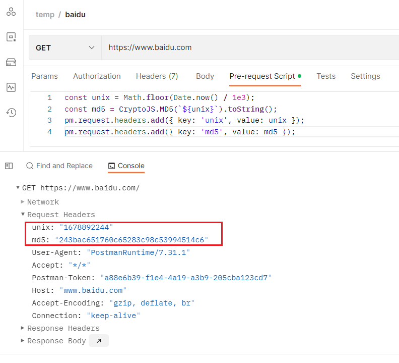
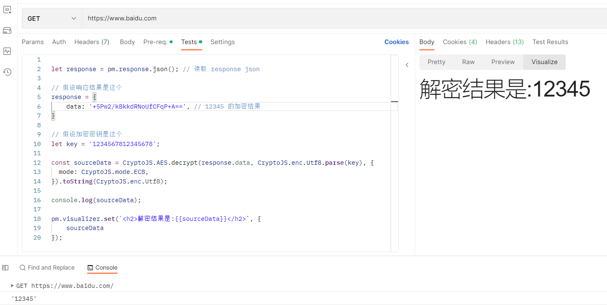

# 使用 Postman 调试解密接口，使用 CryptoJS 和 crypto 和命令行解密图片

## postman 加解密接口

有的时候会遇到需要加密参数和解密 response 的接口，无法直观地从 chrome devtool 的 network 面板中看到 payload 和 response，可以使用 postman 的脚本功能对参数和结果进行处理展示。

还有一点很方便的是 postman 脚本中自带 CryptoJS，直接就能做处理

**示例 1：在请求头中添加时间戳和 md5**



**示例 2：对响应结果进行解密**



> [postman 脚本功能介绍](https://www.cnblogs.com/wozho/p/17217052.html)

## 在 node.js 中使用 CryptoJS 和 crypto 模块做解密

实现解密功能并不难，只需要参考文档调用对应的 api 即可，但需要特别注意的是在 key 和 iv 是字符串类型时最好不要直接传入 CryptoJS 中，因为 Crypto 所用的编码格式未必是预期的。比如数据默认base64编码，key默认utf8编码，但有时候我们会用 hex 方式编码，此时就应该使用 `CryptoJS.enc.Hex.parse()` 方法对 key 编码后再传入 CryptoJS 的加解密函数中

**相关代码**

- [index.js](index.js): 使用 CryptoJS 和 crypto 分别进行 AES 解密数据
- [image.js](image.js): 使用 CryptoJS 和 crypto 分别进行 AES 解密图片，并输出为 html 和文件中

## 命令行使用 openssl 解密图片并输出到文件

```sh
openssl enc -d -aes-128-cbc -K B2F3842866F9583D1ECE61C4E055C255 -iv E01EDE6331D37AFCC7BE05597D654D22 -in data/encrypted-image.jpg -out data/decrypted-openssl.jpg
```
