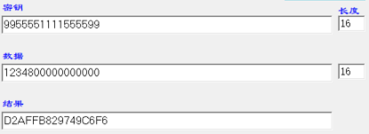

# 在开发 CPU 卡时使用 CryptoJS 对 16 进制字符串计算 DES 时的问题及解决方案

## 背景

在开发 CPU 卡时需要使用 DES 计算过程密钥，网上找到的代码示例大部分是 java 的，尝试使用 CryptoJS 计算但是得到的密文不对，期望是 8 字节但是却得到了 24 字节的结果。

出现问题的主要原因是库本身文档的不完善和对加密相关内容的不了解，而且网上也没有搜到使用 js 对 16 进制字符串计算 des 的示例。

关于对称和非对称加密、DES 相关的知识这里不赘述，可见末尾的参考链接。

## 期望



## 尝试使用搜到的代码

[原始代码在这（错误代码）](des2.js)

**运行结果**

```
$ node des2.js
原文： 1234800000000000
密钥： 9955551111555599
密文： oSDP1wMIioLR6IdlSECczyYYEYrA27uX
密文解密： 1234800000000000
```

## 结果分析

1. 密文可以解密得到原文，说明这段代码本身是没有问题的，只是我使用的方式不对

2. 密文不是我期望的 16 进制字符串而是 Base64 字符串，需要修改成 16 进制字符串

   - 将加密函数 `encryptByDES()` 返回值 `encrypted.toString()` 替换成 `encrypted.ciphertext.toString()`

   - 将解密函数 `decryptByDES()` 中的密文 `CryptoJS.enc.Base64.parse(ciphertext)` 替换成 `CryptoJS.enc.Hex.parse(ciphertext)`

   - 修改后的结果：

     ```
     原文： 1234800000000000
     密钥： 9955551111555599
     密文： a120cfd703088a82d1e8876548409ccf2618118ac0dbbb97
     密文解密： 1234800000000000
     ```

3. 查看代码发现使用了 `CryptoJS.enc.Utf8.parse` 解析密钥字符串，也就是按照 utf8 编码解析，而我的密钥是 16 进制字符串，因此正确的用法应该是 `CryptoJS.enc.Hex.parse`

4. 代码中只把密钥字符串根据 `utf8`编码解析，原文 `message` 是直接作为 `CryptoJS.DES.encrypt` 的第一个参数，这里猜想 CryptoJS 内部默认是将原文字符串按照 `utf8` 解析后再进行 DES 加密。测试后发现使用 `CryptoJS.enc.Utf8.parse(message)` 替换 `message` 时密文不会有变化，说明前面的猜想是对的，因此这里需要将原文也改成按照 16 进制编码处理

   - 将加密函数 `encryptByDES()` 中的原文 `message` 替换成 `messageHex = CryptoJS.enc.Hex.parse(message)`

   - 将解密函数 `decryptByDES()` 中的原文 `decrypted.toString(CryptoJS.enc.Utf8)` 替换成 `decrypted.toString(CryptoJS.enc.Hex)`

   - 修改后的结果：

     ```
      原文： 1234800000000000
      密钥： 9955551111555599
      密文： d2affb829749c6f6f391dd89b1736b72
      密文解密： 1234800000000000
     ```

5. 这时候结果的前 8 bytes（`d2affb829749c6f6`）已经是我要的结果了，但奇怪的是原文明明是 8 byte 但密文却是 16 byte，尝试修改原文后发现结尾的 8 byte 总是 `f391dd89b1736b72` ，对应的原文是 `0808080808080808` ，说明 CryptoJS 自动在原文末尾加上了 8 byte `0808080808080808` ，因此我也只需要忽略末尾 8 byte 即可得到期望的结果。

   PS：默认的补全行为

   - 在原文字节数不是 8 的倍数时会在末尾补 `01` 直到原文字节数为 8 的倍数，如 12345678123456 => 12345678123456**01**
   - 原文字节已经是 8 的倍数时会在末尾补 `0808080808080808` ，如 1234800000000000 => 1234800000000000**0808080808080808**

## 错误原因总结

1. **编码格式错误**：默认是按照的 utf8 编码，但传入 16 进制字符串应该使用 Hex 的编码方式

2. **输入 8 bytes 的原文却获得了 24 bytes 的密文**：因为按照 utf8 时原文中的一个字符编码成 1 个 byte，长度为 16 的字符串编码成 16 byte，加上自动补全的 080808080808080 即 24 byte

   ```
   // 按照 UTF8 编码
   1234800000000000 => 31323334383030303030303030303030 (16 bytes)

   // 按照 Hex（16进制） 编码
   1234800000000000 => 1234800000000000
   ```

## 最终结果

[最终代码在这（成品）](des.js)

```
原文： 1234800000000000
密钥： 9955551111555599
密文： d2affb829749c6f6
密文解密： 1234800000000000
```

**有趣的事情是我找到的这个代码片段是 2013 年写的，而且仅仅一个 gist 便有 40+ 的 star，间接说明了大家都不知道怎么用 `CryptoJS` 。。。😊**

## 参考

> [crypto-js](https://github.com/brix/crypto-js)
>
> [在线测试工具](http://www.jpwz.vip/tool/des.html)
>
> [搜到的代码片段](https://gist.github.com/ufologist/5581486)
>
> [微信小程序-JavaScript 3DES 对称加密算法加密使用](https://blog.csdn.net/gd6321374/article/details/105750232)
