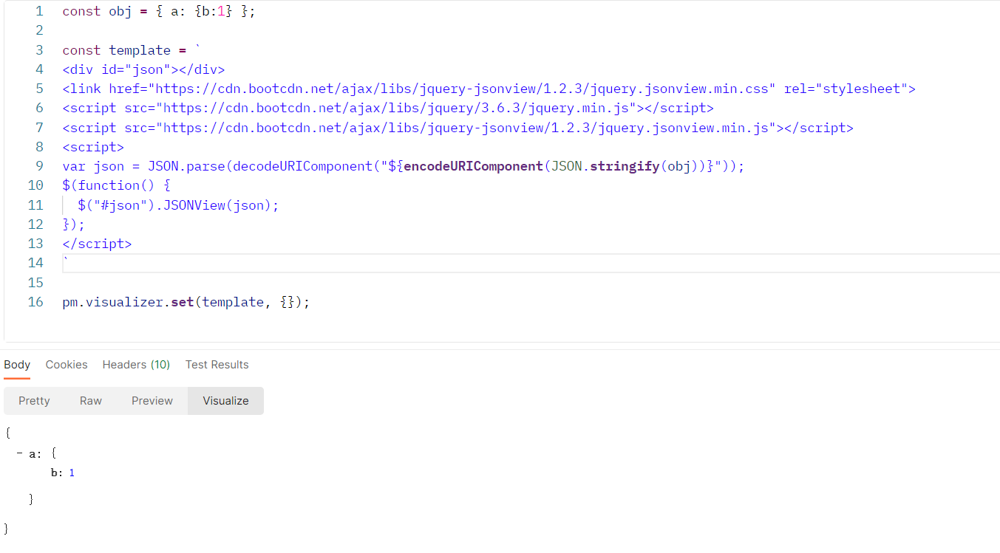

# Postman 使用技巧

内容基本都来自[官方文档](https://learning.postman.com/docs/introduction/overview/)，只是对日常常用特性做一些整理

## 离线模式

Postman 从某个版本开始默认需要登录账号以便同步数据，但是因为众所周知的原因在国内连接很慢（能连上都偷笑了），创建个接口都要等几秒钟。

为此可以选择放弃在线同步功能，设置使用单机版，就能够流畅地创建接口了。虽然这样也不能使用 Mock Server 和 APIs 功能，但也无所谓，反正使用 Postman 最初的主要目的还是用于调试。

> [文档：scratch-pad](https://learning.postman.com/docs/getting-started/using-scratch-pad/)

## 导出/导入

在无法使用在线同步功能却想要备份/多设备共享/与其他人共享时，可以使用导入和导出功能。

> [文档：importing-and-exporting-data](https://learning.postman.com/docs/getting-started/importing-and-exporting-data/)

## 变量 variables

变量有两种，分别为 Collection 级和 Global 级，一般可以用于

- 全局接口地址 BaseURL
- 保存身份标识（token 什么的）
- 其他一些需要在多个接口间共享或需要保存的变量

> [文档：variables](https://learning.postman.com/docs/sending-requests/variables/)

## 请求预处理 Pre-request

有时候可能在发送请求前需要对请求内容做一些处理（比如对参数加密或签名），可以使用 pre-request 脚本实现：

- 读写 variables
- 修改 body/header/url

> [文档：pre-request-scripts](https://learning.postman.com/docs/writing-scripts/pre-request-scripts/)

## 请求结果可视化 visualizer

有时候需要返回结果处理，比如对结果解密后再展示，但是 postman 本身不支持修改响应结果，所以只能通过可视化的方式曲线救国。

示例：使用 json-viewer 展示一个 json

> [文档：visualizer](https://learning.postman.com/docs/sending-requests/visualizer/)
