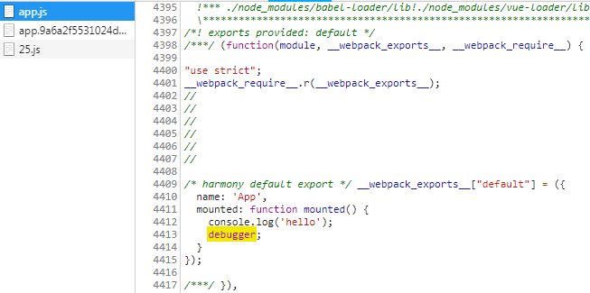

## 使用sourceMap文件定位错误信息

> **来自很久后的更新：**
> 
> 估计是社区里问的人太多，官方已经把这个插件[照抄到微信开发者工具](https://developers.weixin.qq.com/miniprogram/dev/devtools/sourcemap.html)里了，说明这个功能还是很有用的。但让人不解的是官方真的就完全照抄了也不做一点优化，体验辣鸡的一匹，哪怕多实现一个自动下载source map或从错误日志跳转的能力也行呀，你可是大厂啊。。。

### sourceMap是什么

在前端开发过程中代码难免会有错误，即便是再小心，也有可能出现 `Cannot read property 'xxx' of null` 这样的低级失误，debug自然是家常便饭。如何使用chorme的控制台进行debug也有许多技巧，但本文的关注点不在此，不予讨论。

在使用构建工具时，sourceMap相相信大多数人都见过，也知道webpack中的devtool参数可以配置打包生成的sourceMap模式，但是不见得知道如何使用，因为这都是构建工具和浏览器默认自带且默认处理的，多数人不去关注。简单来说，sourceMap就是字面意思，源文件的映射，能够从压缩后的js中找到源文件对应的行列，在定位错误的时候非常有用。

### sourceMap怎么用

`npm run dev`开始开发vue项目，先写一段简单的vue代码

代码内容很简单，就是挂载组件的时候触发断点

这时候打开浏览器就会进入断点：

再看看我们的源码，能够发现连代码行数位置都是完美还原的，为debug提供了极大的方便（极度舒适.jpg）

但是很明显这样的代码是不能跑在浏览器中的，那浏览器是怎么做到的，查看浏览器下载的js文件 `app.js`：

能够发现这一段与我们写下的vue代码基本相同，但是控制台为什么没有显示在这里debugger呢？另外在 `app.js` 的末尾看到这样一行

`//# sourceMappingURL=app.js.map` 这行便是向控制台指明了该文件对应的 sourceMap ，在报错或debugger时控制台会使用该sourceMap文件获得源文件及目前光标位置（不知道怎么形容就暂时称之为光标吧，也就是源文件debugger的位置）

打开 `app.js.map` ，它实际上是一个json文件，我装了json插件才显示成这样，但是很明显这东西我看不懂（摊手）

虽然我看不懂，但并不影响我用它debug，而且一般来说并不需要开发者专门配置什么，这一切都是开箱即用的。

PS：由于示例比较简单且没有压缩转译，即便没有sourceMap也一样能够调试，但是在生产环境线上代码进行压缩和babel转译后会变得非常难以调试，这时候sourceMap便会非常有用。

### 使用sourceMap定位小程序报错信息

微信小程序后台是自带有错误日志记录的功能，原本用的还好好的，错误信息中会带出源文件的路径，顺着路径和提示信息找即可定位错误。但是在爆出能够轻易获得小程序源码的问题后小程序官方在某个版本中加入了压缩混淆的功能（不开还是原来的样子但是开了安全系数更高），报错信息便不再有源文件的路径了。

但是这样我要怎么调试呢，总不能一个一个replace去找吧，而小程序官方提供了sourceMap文件，从上面的尝试知道sourceMap是可以帮助定位错误信息的，但是具体要怎么使用呢？

我便开启了搜索大法，寻找使用sourceMap的办法，发现只需要使用mozilla提供的[source-map](https://github.com/mozilla/source-map)库即可，于是简单做了一个能够利用sourceMap和报错行数获得源码位置的页面，效果是这样的

代码在[这里](https://github.com/WozHuang/try/blob/master/sourceMap/source-map-viewer.html)，使用html写的，直接复制保存就能使用

### 总结

sourceMap开箱即用很舒服，只需要在源码后面加一句 `//# sourceMappingURL=xxx.map`即可，若是没有源码只有错误信息也可以通过[source-map](https://github.com/mozilla/source-map)库定位错误。至于sourceMap的具体原理待日后有时间再深入了解（手动狗头）。

### 参考链接

[使用SourceMap定位问题](https://www.jianshu.com/p/fc622f8cff99)

[MDN：如何使用 source map](https://developer.mozilla.org/zh-CN/docs/Tools/Debugger/How_to/Use_a_source_map)

[GITHUB：mozilla/source-map](https://github.com/mozilla/source-map)
